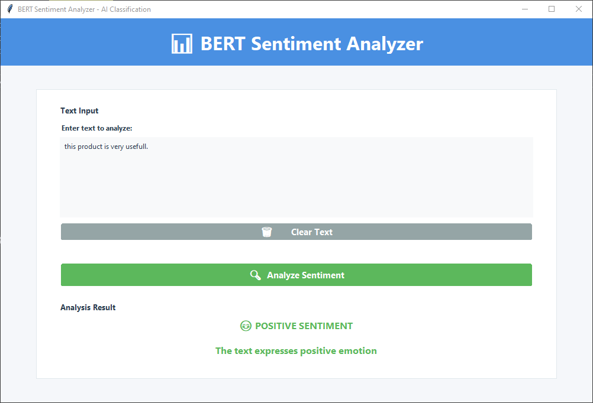
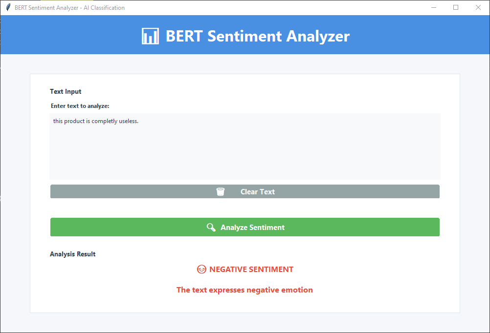

# Text Sentiment Classification with BERT

This project implements a binary sentiment classification model using BERT (Bidirectional Encoder Representations from Transformers) for analyzing movie reviews. The model is fine-tuned on the IMDB dataset to classify text as positive or negative sentiment.

## Table of Contents

- [Overview](#overview)
- [Dataset](#dataset)
- [Model Architecture](#model-architecture)
- [Training Process](#training-process)
- [Performance](#performance)
- [Inference](#inference)
- [Usage](#usage)
- [Requirements](#requirements)
- [Installation](#installation)
- [Contributing](#contributing)
- [Author](#author)

## Overview

Sentiment analysis is a crucial task in natural language processing that involves determining the emotional tone behind a series of words. This project leverages the power of BERT, a state-of-the-art transformer-based model, to achieve high accuracy in binary sentiment classification.

The implementation includes:
- Data preprocessing and tokenization
- BERT model fine-tuning
- Evaluation on test examples
- Inference script for real-time predictions
- **Modern GUI Application**: Interactive desktop application for real-time sentiment analysis

## GUI Application

The project includes a modern, user-friendly desktop application built with Tkinter that provides an intuitive interface for sentiment analysis:

### Screenshots


*Example of positive sentiment detection with visual feedback*


*Example of negative sentiment detection with visual feedback*

## Dataset

The model is trained on the **IMDB Dataset of 50K Movie Reviews**, which contains:
- 50,000 movie reviews from IMDB
- Binary sentiment labels: positive and negative
- Balanced dataset with equal distribution of classes

### Data Preprocessing

- Text normalization: lowercase conversion
- HTML tag removal
- Special character filtering
- Tokenization using BERT tokenizer with max length of 319 tokens

## Model Architecture

The model architecture consists of:

1. **BERT Base Uncased**: Pre-trained BERT model with 12 layers, 768 hidden units, and 12 attention heads
2. **Dropout Layer**: 0.5 dropout rate for regularization
3. **Linear Classifier**: Single linear layer mapping BERT's [CLS] token output to binary classification
4. **Sigmoid Activation**: Converts logits to probabilities

### Model Details

```python
class Bert_model(nn.Module):
    def __init__(self, output_size=1, dropout=0.5):
        super().__init__()
        self.bert = BertModel.from_pretrained('bert-base-uncased')
        self.dropout = nn.Dropout(dropout)
        self.net = nn.Linear(self.bert.config.hidden_size, output_size)
```

## Training Process

### Hyperparameters
- Learning Rate: 5e-5
- Batch Size: 64
- Epochs: 20
- Optimizer: AdamW
- Loss Function: Binary Cross-Entropy Loss

### Training Setup
- Device: GPU (if available) with DataParallel support for multi-GPU
- DataLoader with 4 workers for efficient data loading
- Gradient accumulation and optimization

## Performance

The model demonstrates strong performance on the IMDB dataset:

### Training Metrics
- **Epochs Trained**: 20
- **Final Training Accuracy**: Achieved high accuracy (exact value depends on training run)
- **Loss Reduction**: Consistent decrease in loss over epochs

### Qualitative Evaluation
Manual testing on various example texts shows accurate sentiment predictions:

- "I love this product!" → Positive
- "This service was absolutely awful." → Negative
- "The results were simply excellent." → Positive
- "What a disappointment." → Negative

### Model Size
- **Parameters**: ~110M (BERT base) + ~769 (classifier)
- **Saved Model Size**: ~438 MB (bert_sentiment_classifer.pth)

## Inference
Use the provided scripts to make predictions:

```python
from bert_sentiment_classifier import Bert_model

model = Bert_model()
model.load_model('./model/bert_sentiment_classifer.pth') # path_to_model
model.predict_sentiment("This product is amazing!")
```

## Usage

### Running the GUI Application

To launch the sentiment analysis GUI:

```bash
python sentiment_analyzer.py
```

The application will open a modern desktop interface where you can:
1. Enter or paste text in the input area
2. Click "Analyze Sentiment" to get real-time predictions
3. View results with color-coded feedback and emojis
4. Use the "Clear Text" button to reset the input

### Command Line Inference

For programmatic usage or batch processing:

```python
from model.bert_sentiment_classifier import Bert_model

# Initialize and load the model
model = Bert_model()
model.load_model('./model/bert_sentiment_classifer.pth')

# Make predictions
text = "This product is amazing!"
sentiment = model.predict_sentiment(text)
print(f"Sentiment: {'Positive' if sentiment == 1 else 'Negative'}")
```

## Requirements

- **Python**: 3.7 or higher
- **PyTorch**: 1.9.0 or higher
- **Transformers**: 4.0.0 or higher
- **NumPy**: 1.19.0 or higher
- **Pandas**: 1.3.0 or higher
- **tqdm**: 4.50.0 or higher
- **torchinfo**: 1.5.0 or higher

See `requirements.txt` for exact version specifications.

## Installation

1. Clone the repository:
```bash
git clone https://github.com/walid-moussa55/text-sentiment-classification-bert.git
cd text-sentiment-classification-bert
```

2. Install dependencies:
```bash
pip install -r requirements.txt
```

3. Download the pre-trained model weights:
   - Visit [Kaggle Model](https://www.kaggle.com/models/habbochabbo/bert-text-sentiment-classification)
   - Download the `bert_sentiment_classifer.pth` file
   - Place the downloaded file in the `model/` folder

## Contributing

Contributions are welcome! Please feel free to submit a Pull Request.

## Author

**[WAM Development](https://github.com/walid-moussa55)**

## Summary

This project provides a BERT-based sentiment analysis tool for classifying movie reviews as positive or negative, featuring a user-friendly GUI for real-time predictions.
